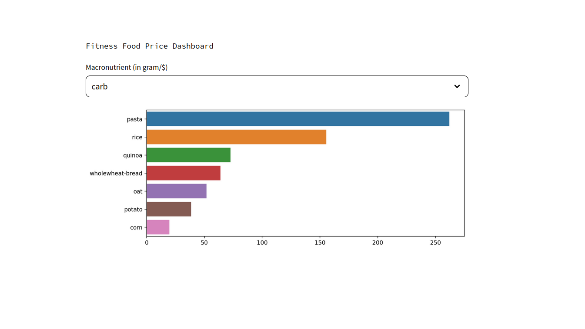

# "Fitness Food on a Budget" Dashboard

This project compares the amount of macronutrients per currency unit for selected food sources sold in two largest Australian supermarket chains: Woolsworths and Coles.

Here is a snippet of the current (minimum viable) result (the Coles' one is coming up soon):

