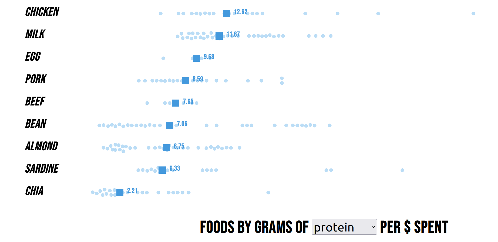

# Fitness Food on Budget

This project helps you figure out the macronutrients you get per dollar from common foods at two big Aussie supermarkets - Woolworths and Coles. The goal is to help you make smarter, budget-friendly food choices that still support your health.

The current visualisation is like this:

(Previous visualisation is: https://fitness-food-on-a-budget.streamlit.app/).

I collected the data by scraping the first page of search results for each food type, then used the median values of in-stock items to calculate typical nutrient content per AUD$.

The project is intended only for personal and educational purposes. I do not take any liability for any consequences that may arise from the use of this project by others, nor am I affiliated with any of these companies.

## How to use

Run `supa.py`, then `supb.py` (coming soon), then `convert_to_json.py`.

Serve the visualisation by running this command inside the vis directory: `python3 -m http.server` and `http://localhost:8000/` in your browser. 

## Other tools used

Insomnia, VS Code Notebook, pipreqs

## Inspiration

This project was inspired by Jeremy Ethier’s video on budget-friendly healthy eating: [watch here](https://www.youtube.com/watch?v=PXub4lr-9J8).